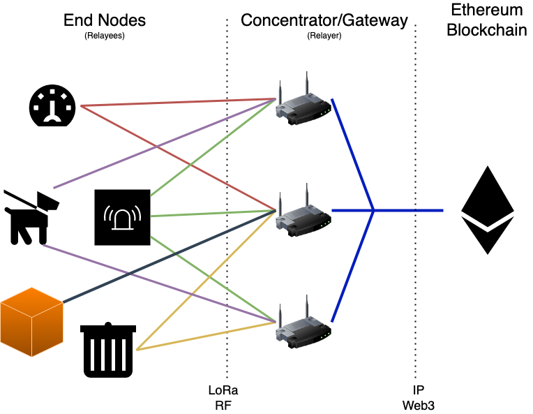

# The FOAM Lite Approach

With the constraints outlined in the introduction, we can now start looking at what an LPWAN-based Ethereum interaction would look like. We’ll start by examining the network topology necessary for a decentralized application receiving data from on-the-ground end devices, followed by a practical example of how such an interaction takes place. We will assume a that we are operating with a basic Layer 1 Ethereum model using familiar ERC20 and ERC721 token transactions, though there is nothing precluding the approach from being modified to take advantage of Layer 2 scaling solutions.

## LPWAN Network Architecture

By now, we’ve seen how a network topology without a centralized network server is important for blockchain applications. Fortunately for us, the concentrators are devices which are capable of communicating over the broader internet and therefore connect to an Ethereum node. Many off-the-shelf LoRa gateway solutions are based on hardware platforms capable of running an Ethereum node themselves. This means that we can start simplifying the overall network architecture — the gateways serve act as ***Relayers*** to the blockchain, and the end nodes are ***Relayees***, having their messages relayed by the gateway. Relayers can operate as regular LPWAN gateways, but they can also test if an LPWAN packet they have received actually encodes a smart contract interaction. If it’s meaningful to do so, the relayer can submit the smart contract interaction as a blockchain transaction on the relayee’s behalf. Effectively, we have a system in which an LPWAN end node can ultimately trigger behavior on a blockchain.

FOAM Lite Network Architecture

## Design Considerations

Now that we have a high-level path towards a relayee-to-blockchain interaction, we can take stock of what challenges and opportunities are presented to us. We find that we have some critical motivations to consider that will ultimately inform the design of the messages the relayee can send, as well as certain functional requirements of the smart contracts that they will interact with.

1. Relayer Incentivization: Running a relayer requires effort and has tangible costs — relayer hardware, internet backhaul, Ethereum infrastructure all need to be accounted for. Moreover, submitting transactions to Ethereum has gas costs in Ether, which must be paid for by the relayer as they will ultimately be one submitting the transaction to the chain. Much as most blockchains have the notion of transaction fees to incentivize actors to validate and secure the chain, we can similarly require that a message somehow causes a transaction fee to be delivered to the relayer for their services.
2. Authentication: Without an authenticated transaction, how can the relayer be certain they’ll get paid for their services? Who is paying them? With what? Most blockchains are predicated on cryptographic identities, with signatures used for authenticating transactions. We can apply that same primitive to the end node’s message and require that it be signed by the end node’s unique private key. This would enable a means for the relayer to verify that the transaction fee for a given message can actually be recouped.
3. Replay Protection: Because these transactions are being broadcast over the air where theoretically anybody can receive them, we would like to ensure that whatever transaction a relayee wishes to submit can only be executed exactly once. At the very least, we would like to stop a greedy relayer from resubmitting the same message to the chain and collect the transaction fee repeatedly while the end node can keep affording it. This is easily accomplished by including a number-used-once (nonce) in the message.
4. Payload: We have to remember that LPWAN packets are extremely small — with a maximum payload of up to 255 bytes per packet in the case of LoRa. Regional restrictions on RF spectrum usage may limit the quantity of packets that can be sent in a given time span. An Ethereum transaction, especially an ABI-encoded smart contract transaction can very quickly grow beyond the size of several such packets, so we must be careful with how we encode the payload being sent to the chain. Remember, we have to at least fit a signature and nonce, which is already likely to take up a nontrivial proportion of packet capacity.
5. Relayer-Awareness: Because it is the relayer ultimately submitting the transaction to the blockchain, the smart contracts that are being interacted with will see that the originator of the transaction is actually the relayer. The smart contract functions would need to take the entire message into account to securely identify the originator as the end node. This design requirement actually ends up helping us — if the smart contract is aware of the fact that it’s receiving a relayed message, then it can also serve to ensure the relayer gets their transaction fee incentive delivered. A relayer can then simply dry-run the transaction and determine whether or not the transaction fee they received in the simulation makes it reasonable to actually submit the transaction compared to the simulated costs of running the transaction. A diverse network of relayers then also creates a competitive transaction fee market, just as in common blockchain design.

## Transaction Fee Considerations and Future Work

Because we have chosen to demonstrate this approach with Ethereum, there are some additional nuances specific to the Ethereum blockchain that we have to consider in our design. Particularly, the transaction fees in Ethereum are calculated in terms of *gas*, which can only be paid for using the blockchain’s native currency, Ether. Unfortunately, the Ethereum blockchain by itself has no facilities to securely delegate access to the Ether balance of a user’s wallet to another user or smart contract — which means that transaction fees cannot be covered directly with Ether.

On the other hand, ERC20 tokens *do* have the ability to delegate control over some or all of a user’s balance of that token to another address by means of the `approve()` function. A particularly famous ERC20 token is known as *Wrapped Ether* or WETH, and is designed to be 1-to-1 exchange with actual Ether. Depending on the design requirements of the system, other similar tokens can of course be used.

Because an end node cannot readily know which relayer will be relaying their transaction a-priori, it does not make sense to simply approve a specific relayer. Moreover, simply approving a relayer would just allow that relayer to claim the approved balance without doing anything else, so that’s not really a viable solution. However, because the end node will likely know what contracts they intend to be interacting with, they can approve that specific contract to spend their ERC20 balance, and the contract can then ensure that the transaction fee makes it to the relayer if the transaction succeeds. This also adds a layer of assurance to the relayer that they will get rewarded for performing their duties.

Because we are using an ERC20 token, the end node will need to have some balance of that token, and will need to have somehow approved the smart contract they’re interacting with to spend that token on their behalf in order to pay the relayer. This means a small amount of ETH would need to be held by the end node as well. This may pose some logistical challenges when considering mass deployments/fleets of end nodes. For the sake of illustrating the technique, we will demonstrate a set of FOAM Lite interactions using an ERC20 token transaction fee in the message. However, smart contracts can be designed such that other means of paying the transaction fee are used. For example, a particular application can keep an on-chain registry of end node addresses that comprise their fleet, and have their particular smart contracts pay out relayers for relaying messages from those nodes. This would radically simplify fleet deployment and management. The end node would not need to periodically have its individual transaction fee balance replenished and the smart contract somehow reapproved to spend the new balance. This would also mean that the transaction fee can be elided from the end node’s message, enabling a larger payload, as well as allowing the overall application to be more responsive to gas market conditions.