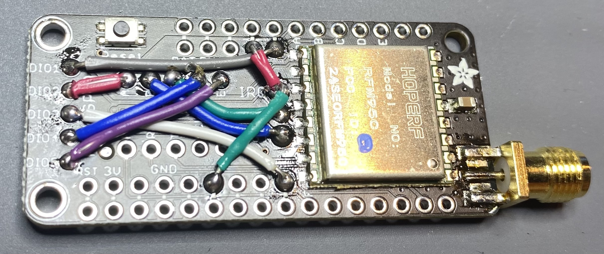

# Embedded Hardware

It is also possible to run the RelayableNFT Example on an embedded device that has a LoRa transceiver. Such a device can be rapidly prototyped using several off-the-shelf, Feather boards and a common USB-UART adapter. Schematic and Gerber files for a printed circuit board that simplifies assembly can be found in the repository. We supply a firmware that exposes commands over an AT-style serial interface to compose, sign, and transmit RelayableNFT messages over LoRa. This firmware is meant to serve as a reference and be modified to suit specific use cases. This firmware can be found in the `end-node/` directory in the main repository.

**If you intend to assemble a transmitter or use this firmware, you MUST read and study this documentation thoroughly. The default settings supplied in the firmware may not be in compliance with the regulations in your region. You are advised to make yourself aware of all regulations pertaining to use of the RF spectrum in your region. You assume responsibility for compliance with regulations pertaining to use of the RF spectrum in your region.  Use this software at your own risk. In no event will Foamspace be liable to any user of this software under any theory for any damages arising from any use of this software.**

## Hardware Assembly

A development device can be assembled using the following components. Familiarity with soldering is required when building your own. If you have received a prototyping kit at ETHDenver 2022, feel free to skip this section. Alternatively, you may assemble a bridge PCB from the schematics and design files in the repository and populate it with buttons and appropriate headers.

### Components

- [Adafruit STM32F405 Feather Express](https://www.adafruit.com/product/4382)
- [Adafruit LoRa Radio FeatherWing (RFM95W)](https://www.adafruit.com/product/3231)
- Jumper wires
- A USB 2.0 (or higher) USB-C cable.
    - The other end can be USB-A or USB-C, so long as you can connect it to your computer.
- An [edge-launch SMA connector](https://www.adafruit.com/product/1865) and corresponding antenna for your intended frequency band.
    - In a pinch, a [simple spring antenna](https://www.adafruit.com/product/4269) may suffice for prototyping purposes, but you run the risk of poor reception.
    - Antenna choice is a complicated subject, but as a safe general choice we would suggest an omnidirectional antenna suitable for your region’s ISM band.
- A USB-UART adapter compatible with 3V3 logic
    - The instructions here assume an [FTDI TTL-232R-3V3 compatible](https://www.adafruit.com/product/70) cable, which would use FTDI’s drivers. When building your own you may find it easier to use a cable with the individual connectors terminated, especially in conjunction with the stacking headers. In such a case, you may need to install the appropriate drivers for the cable you have, which may use the Prolific PL2303 or SiLabs CP210x chipset.
    - [Adafruit’s Raspberry Pi](https://www.adafruit.com/product/954) debug cable is one such cable that uses the latter chipsets.
- [Stacking headers for Feather](https://www.adafruit.com/product/2830)
    - Feather products typically come with only male headers, and assembly is substantially simplified with a set of female headers. The stacking headers are recommended to make it easy to create a jumper on the BOOT0 pin to activate the USB DFU mode on the STM32F405, as well as to access the TX/RX serial lines.

### Connections

1. To maintain compatibility with the many different Feather boards on the market, the Radio FeatherWing requires you to make some of the connections manually. The firmware we shipped assumes the following connections made:
    - **DIO1** to *12-pin Header Parallel, Pin 5* — this pin is unlabeled, but is below what the pin labelled 1*2* on the F405 Feather is, or two pins to the right of the one labelled **USB** on the LoRa FeatherWing.
    - **DIO2** to **A**
    - **B** to **RST**. **NOTE: This is the RST pin near the center of the RadioFeather wing, NOT the RST pin near the corner!**
    - **C** to **CS**
    - **DIO3** to *16-pin Header Parallel, Pin 9* — same problem as explaining DIO1, just see the white wire in the picture. It's the hole directly below the **RST** pin **IN THE CENTER OF THE BOARD**.
    - **DIO5** to **E**
    - The **IRQ **pin ****needs **TWO** connections made:
        - **IRQ** to *12-pin Header Parallel, Pin 4 —* This is pin is immediately to the left of where we connected **DIO1**.
        - **IRQ** to *16-pin Header Parallel, Pin 6* — This is third pin to the left of where we connected **DIO3,** or the second pin to the right of GND on the Feather connector.

        

2. Connect the **TX**, **RX**, and **GND** to the corresponding pins on your USB-UART cable. You may need to cross-over the TX and RX lines, depending on your cable. It is recommended to leave the VCC pin unconnected, as many USB ports will be unable to power both the USB-UART cable and the radio assembly. Instead, it is recommend to power the Feather using the onboard USB connector.
3. In order to enter DFU Mode, you will need to connect the **B0** pin on the F405 Feather to **3V3.** **DO NOT MAKE THIS A PERMANENT CONNECTION!** We recommend using a simple momentary, normally-open SPST switch instgead. The STM32F405 enters DFU mode when **BOOT0** is high when power is applied or when **RST** is released.
    - In other words, to enter DFU mode to flash the firmware, connect **B0** to **3V3**. Press the **RST** button on the F405 Feather (not the Radio FeatherWing!) for two seconds and release. Then immediately disconnect **B0** from **3V3**. You may also opt to wire a button to make this easier if you intend of frequently reflashing the firmware.

## Firmware Compilation and Usage

Once the board is assembled, it will need to be flashed with firmware that drives the LoRa transceiver and signs messages. A compiled version of the firmware can be found as `rnft-f405.dfu` in the root of the repository. If you have received a prototyping kit at ETHDenver 2022, it has already been flashed with this firmware.

### Toolchain and Other Prerequisites

1. If compiling your own firmware: `arm-none-eabi-gcc` suite, 10.3 (2021.07)
    1. Linux users may download it using their distribution’s package manager if available, or [download it directly from ARM](https://developer.arm.com/tools-and-software/open-source-software/developer-tools/gnu-toolchain/gnu-rm/downloads)
    2. Mac users may take advantage of mbed’s Homebrew formulae

        ```
        brew tap ArmMbed/homebrew-formulae
        brew install arm-none-eabi-gcc
        ```

    3. Advanced users with an ST-Link/V2 debug probe may alternatively solder SWD lines to the test points on the bottom of the F405 Feather, and build/debug the project with STM32CubeIDE. They can import the repository as a Non-Managed Makefile Project, and add a build environment variable named `TARGET_PLATFORM` with the value `FEATHER_F405`.
2. If compiling your own firmware: GNU Make.
3. `dfu-util` 0.10
4. screen / minicom / or other serial interface of choice.
5. You may need appropriate drivers based on your USB serial converter. if you have ours, you’ll need FTDI’s drivers
    1. Most Linux distributions already ship with drivers that support the most common USB-UART adapters.
    2. Mac users using an FTDI cable can [download the drivers from FTDI’s website](https://www.ftdichip.com/old2020/Drivers/VCP.htm)

## Compiling

Compiling the firmware is straightforward. With the toolchain installed, run `TARGET_PLATFORM=FEATHER_F405 make`. A DFU image will be created as `BUILD/ltsp.dfu`

## DFU

1. Connect the F405 Feather board to your computer using an appropriate cable,
2. Reset the board into DFU Mode
    1. Hold down RESET and BOOT0 buttons, release RESET while holding BOOT0, release BOOT0
    2. You should see a DFU-class USB device, with `VID: 0x0483, PID: 0xdf11`
3. Flashing:
    1. If you are compiling your own firmware, you can simply run `TARGET_PLATFORM=FEATHER_F405 make dfu` which will compile the firmware and flash it.
    2. if not compiling, `dfu-util --vid 0x0483 --pid 0xdf11 --alt 0 --dfuse-address 0x8000000 -D rnft-f405.dfu -R`
    3. This uses the Feather’s onboard USB DFU device to flash the firmware at address `0x8000000` (which is where the STM32F405 onboard program flash memory starts and where it boots from)
    4. Note that despite using the the `-R` flag, `dfu-util` might fail to reset the device and and complain — this is actually expected behavior for some STM32 chips. As long as the rest of the flashing procedure completed successfully, it is nothing to worry about.
4. Disconnect the USB cable from the Feather F405.

### Serial Firmware Quickstart

1. Disconnect the USB-C cable from the Feather and ensure the USB-Serial adapter is disconnected from your computer. Connect the USB-Serial cable to the Feather. If using the Bridge PCB and an FTDI cable, make sure that the cable is oriented such that pin 1 is ground (the black wire on the cable).
    - **FAILURE TO ENSURE THE CORRECT ORIENTATION MAY CAUSE DAMAGE to the F405 Feather, LoRa FeatherWing, USB Cable, or any combination of those. Seriously. be careful with this!**
2. Connect the USB-Serial cable to your machine, then the USB-C back to the Feather.
    - You’ll be able to find a new device under `/dev` after connecting the USB-Serial adapter. Depending on the cable manufacturer and operating system, these devices may have different names:
        - Linux: `/dev/ttyUSBx` or `/dev/ttyACMx`
        - Mac: `/dev/tty.usbmodemXXXXXX` or `/dev/tty.usbserialXXXXXX`
3. Use your serial program choice to connect to the USB-Serial adapter. If possible, it is recommended to set the output newline format as `CRLF`. The serial interface uses an 115200/8N1 configuration. (115200 baud rate, 8 data bits, no parity bit, 1 stop bit)
    - On Linux and Mac, you may be able to use `stty` prior to launching your serial program to do this for you. There is a slight difference in the capitalization of the -F flag between the two OSes.
        - Linux:  `sudo stty -F /dev/the_tty_device onlcr`
        - Mac: `sudo stty -f /dev/the_tty_device onlcr`
    - Linux users may need to be root when running their serial terminal.
    - If you’ve never used a serial terminal before, `screen` is a good first choice
        - e.g. `sudo screen /dev/the_tty_device 115200`
        - To disconnect, type `Ctrl+A`, followed by `k`, then `y`. Simply closing your terminal may leave `screen` attached to the device, causing issues when reconnecting to the serial interface again. If you forget to do this and find weird issues like your input not going to the device, disconnect and then try `sudo screen -x` to try and reattach to the previous session.
4. Press the RESET button on the Feather F405, you should see a line that says `RESET=v1.0.0,OK`
    - if there’s some kind of `ERROR` in the response, you have a hardware issue somewhere. Ensure that all connections and solder joints have been correctly performed.
    - If you see anything else and you haven’t modified the firmware, ensure you’ve flashed the correct firmware.
5. Type `AT+VERSION` as a sanity check and press enter.
    - Depending on how your terminal is configured, you may have to type `Ctrl+M` `Ctrl+J` to “manually” send a `CRLF` and have your command go through
6. Type in `AT+GENKEY` and press enter
    - Just as above, you may need to type `Ctrl+M` `Ctrl+J` to manually send `CRLF`
    - You should see `GENKEY=<32 byte hex string>,OK`. This a private key that was generated to sign messages with.
7. Verify that the generated key is in use by the device by running `AT+PRVKEY`.
8. Reset the device, and run `AT+PRVKEY` again. You will notice that the private key returned now is `000000...`. Private keys are not persisted across resets, you can tell the device to use the previously generated key by sending `AT+PRVKEY=<the 32 byte hex string previously returned>`.
9. **CHANGE THE RADIO SETTINGS. THE DEFAULT SETTING ON STARTUP IS SET TO RECEIVE MESSAGES FROM A GATEWAY IN THE US, AND YOU SHOULD REALLY NOT TRANSMIT MESSAGES ON THIS CHANNEL. MOREOVER, MOST GATEWAYS WILL NOT RECEIVE YOUR MESSAGES IF YOU TRANSMIT WITH THESE SETTINGS.**

    If you are in the US, you can try `AT+RADIOCFG=904700000,14,0,1,2,8,1`. This will set the radio to transmit and receive on 904.7MHz, with 14dBm transmit power, at `SF7BW125`, with `4/6` overcoding rate and a 12 chirp preamble, with CRC enabled. **See the `AT+RADIOCFG=` command reference for full details.**

    **ENSURE THAT THE SETTINGS YOU USE ARE IN COMPLIANCE WITH YOUR REGIONAL REGULATIONS BEFORE PROCEEDING.**

    - You should see a `RADIOCFG=OK` event.
10. Try transmitting a minting message, with `AT+FLMINT+TX=0,F00D,1234`
    - This will generate, sign, and transmit a minting message with nonce `0`, a `61453*10^-18 (0xF00D)` FungibleToken transaction fee (note, this is the value as represented in the token contract in the minimal denomination), and token data `0x1234`
    - You will see two events, `FLMINTMSG=<long hex string>,OK`, and `TXDATA=<internal transmit timestamp>,OK`
        - If you see `ERROR,<code>` anywhere at this point, check the error code reference below and attempt the troubleshooting steps outlined in this document.
11. Try transmitting a transfer message, with `AT+FLXFER+TX=1,600D,1234,0000000000000000000000000000000000000000`
    - This will generate, sign, and transmit a transfer message with nonce `1`, a `24589*10^-18 (0x600D)` FungibleToken fee, transmitting token ID `1234` (`0x4D2` in hex) to the null (`0x00...`) address.
    - You will see two events, `FLXFERMSG=<long hex string>,OK` and `TXDATA=<internal transmit timestamp>,OK`
        - If you see `ERROR,<code>` anywhere at this point, check the error code reference below and attempt the troubleshooting steps outlined in this document.

## Serial Interface Reference

The firmware shipped with the Feather board provides a a serial interface to perform FOAM Lite operations and send LoRa messages with the onboard LoRa modem using a text-based command interface similar to the Hayes command set. This may be familiar to anyone who has played with a dial-up in the modem in the 90s. For the rest of us, here’s a crash course.

The AT (or Hayes) command is designed to enable configuration of a modem device using a newline-delimited, plain-text interface. Commands, which are typically prefixed with `AT+` (standing for `ATtention`) are sent to the modem to inspect or modify its operating state, or transmit data. The modem sends events either in response to a command, or when external triggers such as receiving data occurs. Unlike conventional modems, we do not have a dedicated “data mode” in our serial interface. All communication between the computer and modem occurs using plain-text commands and events.

Commands and events are separated by DOS style newlines (`CRLF` — a carriage return character (ASCII 0x13) followed by a line feed (ASCII 0x10) character). This is done to simplify automated interaction with the modem, making it unambiguous as to what is considered a separate command or event.

Commands come in two flavors, parameterized and unparameterized. Parameterized commands take the form of `AT+<command_name>=param1[,optional_param_2[,optional_param_3...]]` — taking an optional list of parameters separated by commas. These are used to change the operating state of the device, or make it transmit data. Unparameterized commands take the form of `AT+<command_name>`, but do not have an `=` nor take any parameters. These are used to inspect the running configuration of the device. Some parameterized commands have an unparameterized counterpart — these emit an event with the same name as the command which can be prefixed `AT+` and sent back to the device to return it to the state in which it was when the unparameterized command was sent.

Events, on the other hand, always take the form of `<event_name>=[param_1,[optional_param_2,...]<status code>`. All events will always have at least a status code associated with them.  For example, when you first connected to the board and pressed the RST button, you saw a `RESET=v1.0.0,OK` event — signifying that the device is running firmware `v1.0.0` and started up successfully. If you had a hardware failure, you may have seen `RESET=v1.0.0,ERROR,0` instead. A full list of status codes can be found later in this documentation. Typically, a command will be followed by an event with the same name. However, certain commands, particularly `AT+FLMINT+TX=` and `AT+FLXFER+TX=` may emit two events with unrelated names.

By default, the firmware echoes back whatever is typed into it, this is to make human interaction intuitive. This can be disabled with the `AT+ECHOBACK=` command.

### Parameter Formats

Typically, there are four variants of parameters that the various commands take. These are:

- Unsigned integers — expressed as base 10 integers.
    - Good: `0`, `1`, `42`, `999`, `12309`
    - Bad: `-1`, `-FFF`, `-0xFF`, `hello`, `123F`, `0xABCD`
- Fixed length hex string — these are fixed-size byte-strings represented as hex characters. Because this is byte data of an exact size, the strings must be a specific length and comprised of hexadecimal digits. They do not have a `0x` prefix.
    - Good (assuming a fixed length of 4 bytes): `00000000`, `12345678`, `ABCD1234`
    - Bad (assuming a fixed length of 4 bytes): `hello`, `0`, `00`, `0x00000000`, `0x1234567`, `0xABCD1234`, `hello`
- Variable length hex string — these are strings of bytes, represented as hex characters. Because they are meant to represent actual byte data, they must have an even number of hex digits. They do not have a `0x` prefix.
    - Good: `00`, `10`, `F000`, `600DCAFE`
    - Bad: `0`, `A`, `F00`, `hello`, `0x00`, `0x10`, `0xF000`, `0x600DCAFE`
- Variable length hex number — these are unsigned hexadecimal numbers, supplied as hex strings of their big-endian byte representation. The string must be an even number of characters, prefixed with a `0` if necessary. They are variable length to avoid having to supply an unwieldy amount of `00`s when representing large numbers. They do not have a `0x` prefix.
    - Good: `00`, `10`, `F000`, `600DCAFE`
    - Bad: `0`, `A`, `F00`, `hello`, `0x00`, `0x10`, `0xF000`, `0x600DCAFE`, `-FF`, `-0x12`, `-0xA`

### Event Status Codes

A full list of status codes can be found below

- `OK` — the requested operation completed successfully
- `ERROR,0` — A hardware failure has occurred in the device
- `ERROR,1` — Incomplete, invalid, or malformed parameters were given with a command
- `ERROR,2` — An error occurred while transmitting data over LoRa
- `ERROR,3` — An operation timed out.
    - This is typically indicative of a faulty connection either with the FeatherWing and the Feather, or within the Feather itself. However, if you are attempting to send a long payload over the air with slow radio settings, this may also trigger this status code.
- `ERROR,100` — The blockchain subsystem has never been initialized in the firmware
    - You should never see this, unless you are porting the firmware to another device and have passed a NULL somewhere.
- `ERROR,101` — The blockchain subsystem is using an invalid private key. This typically occurs when trying to sign messages without setting a private key after resetting the device.
- `ERROR,102` — An invalid signature was supplied to `AT+ECRECOVER` or `AT+ETHRECOVER`
- `ERROR,103` — A public key could not be recovered from the data to supplied to `AT+ECRECOVER` or `AT+ETHRECOVER`, likely due to invalid data
- `ERROR,240` — The requested operation is unsupported on this device.
    - You should never see this, unless you are porting the firmware to another device and have chosen to use this error code.

### List of Events

While most events are sent as a response to a command, there are a few events which do not correspond to any command. All events have at least a status code associated with them, which is elided from their description and can be referenced above. All events are outlined here for reference.

- `RESET`: Sent when the device first boots up, in a response to an `AT+RESET` command.
    - Format: `RESET=<version string>,<status code>`
    - `<version string>` is the semantic version of the firmware on the device in the format `v<MAJOR>.<minor>.<patch>`
- `VERSION`: Sent in response to an `AT+VERSION` command
    - Format: `VERSION=<version string>,<unique device id>,<supported commands,...>,<status code>`
    - `<version string>` is the semantic version of the firmware on the device in the format `v<MAJOR>.<minor>.<patch>`
    - `<unique device id>` the unique serial number of the STM32F405 chip as burned into the hardware.
    - `<supported commands>` is a comma-separated list of commands supported by the firmware, without the `AT` prefix.
- `ECHOBACK`: Sent in response to an `AT+ECHOBACK` or `AT+ECHOBACK=` command
    - Format: `ECHOBACK=<current value>,OK` in response to an unparameterized `AT+ECHOBACK`
    - Format: `ECHOBACK=<status code>`, in response to a parameterized `AT+ECHOBACK=`
        - Status code `OK` is sent if the echoback setting is updated successfully
        - Status code `ERROR,1` is sent if an invalid parameter was specified
- `RADIOCFG`: Sent in response to an `AT+RADIOCFG` or `AT+RADIOCFG=` command
    - Format: `RADIOCFG=<current settings,OK` in response to an unparameterized `AT+RADIOCFG`. See the description for the `AT+RADIOCFG=` command for more details on these settings.
    - Format: `RADIOCFG=<status code>`, in response to a parameterized `AT+RADIOCFG=`
        - Status code `OK` is sent if the radio configuration settings are updated successfully
        - Status code `ERROR,1` is sent if an invalid parameter was specified
- `TX`: Sent when a radio transmission completed, in response to `AT+TX=`
    - Format: `TX=<internal timestamp>,OK` if the transmission completed successfully
    - Format: `TX=<status code>` if an error occurred while transmitting.
    - The internal timestamp is an artifact from the history of this firmware, and can be safely ignored.
- `TXDATA`: Sent when a radio transmission is complete following an `AT+FLMINT+TX=` or `AT+FLXFER+TX=` command
    - Format: `TXDATA=<internal timestamp>,OK`
    - Format: `TXDATA=<status code>` if an error occurred while transmitting
    - The internal timestamp is an artifact from the history of this firmware, and can be safely ignored.
- `RNG`: Sent in response to an `AT+RNG` command
    - Format: `RNG=<random uint32 in base 10>,OK`
- `KECCAK256`: Sent in response to an `AT+KECCAK256=` command
    - Format: `KECCAK256=<32 byte hex string>,OK` where the hex string is the Keccak256 hash of the data supplied to the `AT+KECCAK256=` command
    - Format: `KECCAK256=ERROR,1` if an invalid input was given to the command
- `GENKEY`: Sent in response to an `AT+GENKEY` command
    - Format: `GENKEY=<32 byte hex string>,OK` containing the generated private key
- `PRVKEY`: Sent in response to an `AT+PRVKEY` or `AT+PRVKEY=` command
    - Format: `PRVKEY=<32 byte hex string>,OK` in response to an unparameterized `AT+PRVKEY` command containing the private key currently used for signing messages
    - Format: `PRVKEY=OK` in response to a parameterized `AT+PRVKEY=` containing a valid private key
    - Format: `PRVKEY=<status code>` in response to a parameterized `AT+PRVKEY=` containing an invalid private key
- `PUBKEY`: Sent in response to an `AT+PUBKEY` command
    - Format: `PUBKEY=<64 byte hex string>,OK` where the hex string is the uncompressed public key corresponding to the active private key, without the `04` prefix
- `ETHADDR`: Sent in response to an `AT+ETHADDR` command
    - Format: `ETHADDR=<20 byte hex string>,OK` where the hex string is the Ethereum address corresponding to the active private key
- `ECRECOVER`: Sent in response to the `AT+ECRECOVER=` command
    - Format: `ECRECOVER=<64 byte hex string>,OK` if a public key could be successfully recovered from the supplied input
    - Format: `ECRECOVER=<status code>` if a public key could NOT be successfully recovered from the supplied input
- `ETHRECOVER`: Sent in response to the `AT+ETHRECOVER=` command
    - Format: `ETHRECOVER=<20 byte hex string>,OK` if a public key could be successfully recovered from the supplied input, then the hex string will contain the corresponding Ethereum address
    - Format: `ETHRECOVER=<status code>` if a public key could NOT be successfully recovered from the supplied input, and hence an Ethereum address could not be computed
- `FLMINTHASH`: Sent in response to the `AT+FLMINTHASH=` command
    - Format: `FLMINTHASH=<32 byte hex string>,OK` if a signing hash could be computed from the supplied input
    - Format: `FLMINTHASH=<status code>` if a signing hash could not be computed from the input
- `FLXFERHASH`: Sent in response to the `AT+FLXFERHASH=` command
    - Format: `FLXFERHASH=<32 byte hex string>,OK` if a signing hash could be computed from the supplied input
    - Format: `FLXFERHASH=<status code>` if a signing hash could not be computed from the input
- `FLMINTMSG`: Sent in response to the `AT+FLMINTMSG=` and `AT+FLMINT+TX=` commands
    - Format: `FLMINTMSG=<variable length hex string>,OK` if a valid minting message was constructed from the input and successfully signed. When received as a response to the `AT+FLXFER+TX=` command, a `TXDATA` event should be expected to occur shortly thereafter.
    - Format: `FLMINTHASH=<status code>` if a mint message could not be constructed from the input, or the private key currently in use is invalid
- `FLXFERMSG`: Sent in response to the `AT+FLXFERMSG=` and `AT+FLXFER+TX=` commands
    - Format: `FLXFERMSG=<variable length hex string>,OK` if a signing hash could be computed from the supplied input. When received as a response to the `AT+FLXFER+TX=` command, a `TXDATA` event should be expected to occur shortly thereafter.
    - Format: `FLXFERMSG=<status code>` if a transfer message could not be constructed from the input, or the private key currently in use is invalid

### List of Commands

A full list of commands supported by the firmware is described below. Note that some commands have both a parameterized and unparameterized variant. These are listed separately.

Basic commands corresponding to core functionality of the serial interface:

- `AT+RESET`: Resets the device and reinitializes the hardware
    - Response: A `RESET` event will be emitted in response to this command.
- `AT+VERSION`: Gets the version of the firmware running on the device.
    - Response: A `VERSION` event will be emitted in response to this command
- `AT+ECHOBACK`: Gets the current echoback setting of the device. The echoback setting determines whether input sent over the serial is printed back as it’s received.
    - Response: An `ECHOBACK` event will be emitted in response to this command.
- `AT+ECHOBACK=`: Changes the current echoback setting. It may be useful to disable echoback when writing software that interfaces directly with the serial interface, to prevent the software’s own input from being interpreted as event data.
    - Format: `AT+ECHOBACK=0` to disable echoback.
    - Format: `AT+ECHOBACK=1` to enable echoback.
    - Default: The default setting is `AT+ECHOBACK=1` when the device resets.
    - Response: An `ECHOBACK` event will be emitted in response to this command

Commands that configure the radio:

- `AT+RADIOCFG`: Gets the current radio configuration settings
    - Response: A `RADIOCFG` event will be emitted in response to this command
- `AT+RADIOCFG=`: Changes the current radio settings.
    - Consult the LoRa channel plan for your region to determine the best settings to use based on your needs.
    - Format: `AT+RADIOCFG=<channel frequency>,<transmit power>,<bandwidth>,<chip rate>,<coding rate>,<preamble length>,<crc enable>`
        - Channel frequency: An unsigned base 10 integer, representing the operating frequency in Hz
        - Transmit power: An unsigned base 10 integer, representing the transmit output power in dBm. Valid values are in the range of `0-20`
        - Bandwidth: LoRa chirp bandwidth. Possible values are:
            - `0`: 125KHz
            - `1`: 250KHz
            - `2`: 500KHz
        - Chip Rate: Chip rate is directly correlated to spreading factor in LoRa terms. Possible values are:
            - `0`: For `SF6`, or 64 chips/symbol
            - `1`: For `SF7`, or 128 chips/symbol
            - `2`: For `SF8`, or 256 chips/symbol
            - `3`: For `SF9`, or 512 chips/symbol
            - `4`: For `SF10`, or 1024 chips/symbol
            - `5`: For `SF11`, or 2048 chips/symbol
            - `6`: For `SF12`, or 4096 chips/symbol
        - Coding Rate: Forward error correction overcoding rate
            - `0`: For 4/5 coding
            - `1`: For 4/6 coding
            - `2`: For 4/7 coding
            - `3`: For 4/8 coding
        - Preamble length: Number of symbols to send as part of the preamble. Note that the hardware itself adds 4 to whatever you specify. This is an unsigned integer in base 10.
        - CRC Enable
            - `1`: to enable CRC when transmitting and receiving
            - `0`: to disable CRC when transmitting receiving
    - Default: `AT+RADIOCFG=923300000,14,2,1,0,8,1`
    - Response: A `RADIOCFG` event will be emitted in response to this command
- `AT+TX`: Transmits data over radio. **THIS WILL ACTUALLY TRANSMIT DATA USING THE RADIO.**
    - Format: `AT+TX=<variable length hex string>` containing the data you wish to transmit.
    - Response: A `TX` event will be emitted in response to this command.


Blockchain / cryptography-related commands:

- `AT+RNG`: Generates a random number using the hardware RNG in the STM32F405
    - Response: An `RNG` event will be emitted with the generated number in response to this command.
- `AT+KECCAK256=`: Calculates the Keccak256 hash of the supplied data
    - Format: `AT+KECCAK256=<variable length hex string>`
    - Response: A `KECCAK256` event will be emitted in response to this command
- `AT+GENKEY`: Generates a new private key for signing, replacing the currently active private key for signing messages.
    - Response: A `GENKEY` event containing the newly generated private key will be emitted in response to this command.
- `AT+PRVKEY`: Gets the currently active private key used for signing messages.
    - Response: A `PRVKEY` event containing the currently active private key will be emitted in response to this command.
- `AT+PRVKEY=`: Replaces the currently active private key used for signing messages
    - Format: `AT+PRVKEY=<32 byte hex string>`
    - Response: A `PRVKEY` event reflecting the change in private key (i.e., `OK/ERROR`) will be emitted in response to this command.
- `AT+PUBKEY`: Gets the public key corresponding to the currently active private key
    - Response: A `PUBKEY` event containing the public key will be emitted in response to this command
- `AT+ETHADDR`: Gets the Ethereum address associated with this public key.
    - Response: An `ETHADDR` event containing the Ethereum address associated with the active private key will be emitted.
- `AT+ECRECOVER=`: Attempts to recover the public key from a signature and the digest that was signed
    - Format: `AT+ECRECOVER=<digest>,<signature>`
        - Digest: A 32-byte hex string (typically, a Keccak256 digest is signed in Ethereum, and the RelayableNFT transactions)
        - Signature: A 65-byte hex string corresponding to the signature to attempt to recover a public key from, in `r,s,v` format.
            - `v` can be supplied in either the secp256k1-style `0` or `1` (`0x00`/`0x01`), or in the Bitcoin/Ethereum style as `27` or `28` (`0x1B`/`0x1C`).
    - Response: An `ECRECOVER` event will be emitted in response to this command.
- `AT+ETHRECOVER=`: Attempts to recover the Ethereum address belonging to the private key associated with a signature
    - Format: `AT+ETHRECOVER=<digest>,<signature>`
        - These are the same parameters as `AT+ECRECOVER`
    - Response: An `ETHRECOVER` event will be emitted in response to this command

### RelayableNFT-related Commands

There are six commands related to the RelayableNFT example. Three of them are related to minting messages, and three of them are related to transfer messages.

- `AT+FLMINTHASH=`: Calculates the signing hash for a specified RelayableNFT minting message
    - Format: `AT+FLMINTHASH=<nonce>,<fee>,<minting data>`
        - The nonce is specified as an unsigned integer, in base 10
        - The fee is specified as a variable length hex integer (as a 128-bit hex-encoded, big-endian number). Leading `00`s may be elided, so long as they are elided in groups of two.
        - The minting data is specified as a variable length hex string.
    - Response: An `FLMINTHASH` event will be emitted in response to this command
- `AT+FLMINTMSG=`: Signs and encodes a RelayableNFT minting message suitable for transmitting over the air, without actually transmitting it.
    - Format: `AT+FLMINTMSG=<nonce>,<fee>,<minting data>`
        - These are the same parameters as `AT+FLMINTHASH=`
    - Response: An `FLMINTMSG` event will be emitted in response to this command.
- `AT+FLMINT+TX=`: Signs and encodes a RelayableNFT minting message, **AND TRANSMITS IT OVER RADIO IF SUCCESSFULLY SIGNED**
    - **THIS COMMAND TRANSMITS DATA OVER RADIO**
    - Format: `AT+FLMINT+TX=<nonce>,<fee>,<minting data>`
        - These are the same parameters as `AT+FLMINTHASH=` and `AT+FLMINTMSG=`
    - Response: An `FLMINTMSG` event will be emitted in response to this command. Additionally, if the minting message was successfully generated and signed, a `TXDATA` event will be generated as soon as the transmission completes.

- `AT+FLXFERHASH=`: Calculates the signing hash for a specified RelayableNFT transfer message
    - Format: `AT+FLXFERHASH=<nonce>,<fee>,<token ID>,<destination address>`
        - The nonce is specified as an unsigned integer, in base 10
        - The fee is specified as a variable length hex integer (as a 128-bit hex-encoded, big-endian number). Leading `00`s may be elided, so long as they are elided in groups of two.
        - The token ID is specified as an unsigned integer, in base 10
        - The destination address is specified as a 20-byte hex string.
    - Response: An `FLXFERHASH` event will be emitted in response to this command
- `AT+FLXFERMSG=`: Signs and encodes a RelayableNFT transfer message suitable for transmitting over the air, without actually transmitting it.
    - Format: `AT+FLXFERMSG=<nonce>,<fee>,<token ID>,<destination address>`
        - These are the same parameters as `AT+FLXFERHASH=`
    - Response: An `FLXFERMSG` event will be emitted in response to this command.
- `AT+FLXFER+TX=`: Signs and encodes a RelayableNFT trans message, **AND TRANSMITS IT OVER RADIO IF SUCCESSFULLY SIGNED**
    - **THIS COMMAND TRANSMITS DATA OVER RADIO**
    - Format: `AT+FLXFER+TX=<nonce>,<fee>,<token ID>,<destination address>`
        - These are the same parameters as `AT+FLXFERHASH=` and `AT+FLXFERMSG=`
    - Response: An `FLXFERMSG` event will be emitted in response to this command. Additionally, if the transfer message was successfully generated and signed, a `TXDATA` event will be generated as soon as the transmission completes.

## Troubleshooting

If you are having trouble interacting with your device, such as unexpected error codes, here are some common troubleshooting steps. Before going deeper, verify that the following holds true:

1. Are the F405 Feather and Radio FeatherWing connected together firmly?
    - If you are using a Bridge PCB, ensure that the same is true for the Bridge PCB and the FeatherWing
2. Are all solder joints adequate and headers intact?
3. Are you using good quality USB cables and adapters?
    - Particularly, USB-A/USB-C converters tend to degrade over time.
4. Are other devices working in the USB ports you are connecting your cables to?
    - This happens more often than you think! Certain USB hubs are particularly naughty about not re-enumerating devices that reconnect.
    - You may have a dead port! This also happens more often than you think!
5. Are your USB ports sufficiently powered and capable of USB 2.0?
6. Have you tried turning it off and on again?
    - Seriously, sometimes a reboot of your machine works wonders. Ditto for disconnecting and reconnecting the Feather and USB-Serial adapters.

If you are experiencing issues interfacing with the device over serial, and the steps above didn’t help, there may be more specific troubleshooting steps.

1. Can’t find a USB-Serial device in `/dev`
    1. Is the adapter detected by your system at all?
        1. e.g., with `lsusb` or in About This Mac → USB devices
            1. If not, your adapter may be faulty. Try again with a different USB-Serial device
        2. Are you running into permissions issues? On certain systems, you might need to access the device as root (with `sudo`).
    2. Do you have the appropriate drivers installed?
        1. the instructions here are assuming an FT232R-based USB cable, you may be using a different chip in your adapter. Common alternative chipsets are the Prolific PL2303 and SiLabs CP210x.
        2. Some counterfeit FT232R-based cables have been known to be susceptible to bricking by the official driver. If that’s the case, try another cable... sorry :(
2. No output on the serial
    1. If you are using the Bridge PCB, check the orientation of the serial header. The `GND` (black wire) should be on Pin 1 of the serial connector (marked on the board), opposite the the `FOAM lite` text.
    2. Are you using the correct serial settings? (115200 baud, 8 data, no parity, 1 stop bit)
    3. If you wired your own adapter, did you connect ground? (the black wire)
    4. If you wired your own adapter, make sure the TXD and RXD pins are oriented correctly (their colors might be different, e.g. green/white for TXD/RXD on many PL2303-based cables. Generally, black is GND, and red should be left unconnected):
        1. If you are using the Bridge PCB, the following is the pinout for the header, which assumes an FTDI cable pinout.

        | Pin | Wire Color | Signal |
        | --- | --- | --- |
        | 1 | Black | GND |
        | 2 | Brown | CTS (not connected) |
        | 3 | Red | 5V (connected to VUSB solder-jumper to Feayejr) |
        | 4 | Orange | TXD (swappable 3-pos solder jumper to Feather) |
        | 5 | Yellow | RXD (swappable 3-pos solder jumper to Feather) |
        | 6 | Green | RTS (not connected) |
    5. Ensure that the USB-serial adapter you have is in working condition (no frayed/torn wires.
    6. Ensure that the USB-serial adapter you are using is made for 3V3 logic level. 5V may damage the F405 Feather.
    7. If the VUSB solder-bridge is set on the Bridge PCB, make sure your USB port can supply enough current to power both the transmitter board and the USB-Serial adapter
        1. Additionally, make sure that the 5V power pin is *actually* 5V, not 3V3, as there are some FTDI cables that are 3V power AND logic!
        2. You may want to either desolder the VUSB bridge or remove the 5V pin, and power the Feather using its USB-C connector.
3. Erratic output over the serial
    1. Are you running at the proper serial settings? (115200 baud rate, 8 data bits, no parity bit, 1 stop bit)
    2. Is ground properly connected?
    3. Could something be causing a short circuit?
    4. Do you inadvertently have multiple programs attempting to access the serial device? (e.g., a lingering `screen` session which was not killed, or multiple terminal windows attempting to control the device simultaneously)