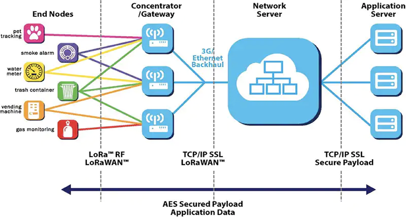

# Introduction

FOAM Lite is proof-of-concept protocol which enables smart devices to interact with smart contracts running on the Ethereum blockchain over a low-power, wide-area network (LPWAN) by leveraging a compact encoding scheme which interacts with familiar Ethereum ecosystem components. It allows smart devices to submit authenticated data to the Ethereum blockchain, while simultaneously incentivizing grassroots deployments of LPWAN infrastructure.

## Background

A brief introduction to LPWAN is necessary to properly motivate FOAM Lite. Because FOAM Lite has been demonstrated with LoRa, this summary will use examples from the LoRa(WAN) ecosystem. It is important to note, however, that the overall concepts of LPWAN network architecture and operation are fairly common across the various LPWAN technologies and ecosystems such as SigFox, DASH7, NB-IoT, etc. A cursory familiarity with computing concepts such as IP networking, Ethernet, as well as general blockchain concepts such as centralized vs. decentralized systems, cryptographic signatures, and transactions and transaction fees is also assumed. Familiarity with the Ethereum blockchain and ecosystem is also recommended.

## LPWAN

LPWAN networks enable connected devices to communicate over large physical distances while consuming little power, thereby enabling such devices to operate in an unattended manner for an extended period of time. This large communication range and low power consumption comes at the cost of low bit-rate and limited data carrying capacity, which poses unique challenges when attempting to apply such technologies to blockchain applications.

Conventional LPWAN networks and applications tend to rely on the presence of one or more ***gateways —*** devices with conventional WAN backhaul that receive LPWAN packets and forward them to centralized services, typically in the cloud, for processing. These services may then optionally send small payloads back to the end nodes. The LoRaWAN network architecture is illustrated below:

LoRa Network Architecture. Source: Semtech

In a typical LPWAN application, smart devices (labelled *end nodes* in the above diagram), often without a permanent power source (i.e., battery-powered) and without a direct internet connection — broadcast small messages on the order of dozens of bytes, which are received by *gateways*. Gateways are permanently-powered (always-on) infrastructure components which have access to the internet and contain specialized hardware that allow them receive data from multiple end nodes simultaneously across various channels in the RF spectrum. When a gateway receives a message, it forwards its contents to a *Network Server*, a centralized system which marshals various payloads to the destination *Application Server* for they were intended — also, typically, a centralized system.

It should be evident that any application wishing to leverage LPWAN technology needs to consider the availability of gateways in the area it wishes to serve, that all of these gateways are interacting with the same network server, such that their application can interact. In some cases, this may mean that the developer of the application would need to entirely operate that infrastructure themselves, creating barriers to initial deployment and scaling. Efforts have been made to address this challenge — a particularly noteworthy effort being The Things Network — an open collaborative community of gateway operators and LPWAN application developers pointing their gateways to a Network Server operated by The Things Network’s corporate steward. Users contribute their Gateway hardware by pointing it to The Things Network’s Network Server and register their applications with it, allowing them to leverage a global community of network operators. Of course, such a community effort has no uptime guarantees, and ultimately, and its participants are primarily motivated to operate gateways to enable their own applications. Indeed, anyone wishing to develop applications requiring more stringent uptime guarantees are advised to run their own private network deployments, fundamentally undermining the promised advantages of a collaborative network operation.

Furthermore, the overall network architecture, despite requiring a physically decentralized network of gateways to provide wide geographical coverage, still relies on a topology consisting of centralized network coordination and application servers to enable its functionality. Of course, this comes with all of the conventional drawbacks of depending on a centralized system, such as a lack of transparency on how collected data is utilized and processed, and points of failure which may be difficult to reason about. Moreover, in considering the effect of this architectural constraint on novel decentralized applications, one can readily conclude that requiring inputs ingested through what is effectively a centralized black-box is likely to undermine many of the benefits that a decentralized application would otherwise be able to provide.

## Blockchain

With the aforementioned considerations of data provenance and operator incentivization in mind, those familiar with blockchain and distributed ledger technology may have a hunch that many of the fundamental concepts behind the aforementioned may offer solutions. Indeed, many dedicated blockchain projects have been introduced with the aim of addressing Internet-of-Things use cases, all offering approaches and roadmaps to solve the challenges they perceive facing IoT applications today. Indeed, the diversity of IoT-related blockchain projects testifies to the fact that it’s really difficult to design a universal solution. Rather than attempting to compare the merits and pitfalls of various projects, we can holistically assess what helps and hinders the application of blockchain to IoT, particularly as it applies to low-power devices.

When considering LPWAN applications, we must remember that our physical layer is limited in bandwidth and bitrate, as well as potential regulatory restrictions on usage of the radio spectrum — therefore any interaction with the blockchain by the end nodes needs to fit into as small a data packet as possible. Because of the fact that we are dealing with such a constraint network link, depending on the latest state of the blockchain is effectively a non-starter. Additionally, we would like to avoid depending on the historical state of the blockchain, as this has the potential to introduce onerous storage requirements, which are likely to be rendered moot as there would be no way to meaningfully keep it up to date. Finally, we have to consider that many of our end devices may be battery-powered, likely using microcontrollers or similar low-power processors with limited RAM — so we also can’t generate zero-knowledge proofs on the end devices (not that it would matter, as the sizes of the proofs are still way too large to fit into an LPWAN packet).

While this seems scary, it turns out that we can still take advantage of cryptographic signatures to ensure the integrity and authentication of the data we submit to the blockchain. When considering what kind of data is typically submitted to a blockchain, we find that at the bare minimum a blockchain transaction consists of a:

1. A cryptographic signature of the contents of the transaction,
2. A number-used-once (nonce) to ensure that the transaction can only be executed exactly once,
3. A transaction fee to incentivize the validators of the ledger to include the transaction into the record, and finally
4. The actual operations we wish to perform against the ledger.

In the case of a programmable blockchain such as Ethereum, the latter data can be used to trigger smart contracts that can perform generalized computing applications. This is a rather powerful concept, as this opens avenues for decentralized applications to replace the centralized components present in the conventional LPWAN network architecture.

## FOAM Lite and the Ethereum-of-Things

By now, we should be sufficiently motivated to see where FOAM Lite fits in. We already have a geographically decentralized ecosystem of off-the-shelf LoRa concentrators, which are forwarding the data they receive over LoRa to a centralized network server, which then further forwards that data to centralized application servers. It would be useful to have the final application servers be decentralized applications to allow for fresh paradigms in transparency, accountability, and governance. Of course, this would still raise the question about the integrity of the data coming into those DApps. Indeed, if we were to also replace the notion of the Network Server with a decentralized application in itself, then what we would end up with is a fully decentralized LPWAN network architecture, that also grants us end-to-end provenance of the applications actions and outputs. Built upon the rich developer ecosystem present in Ethereum, such a system would end up creating a novel class of decentralized smart device services and applications — **the** **Ethereum-of-Things*.***

FOAM Lite leverages the programmability of the Ethereum blockchain to enable smart contracts to receive cryptographically authenticated inputs from low-cost off-the-shelf LoRa hardware. It aims to build a grassroots LPWAN network which enables novel approaches to the governance of public goods and services, create new forms of secure data markets, and usher in a new paradigm of meaningful, tangible interactions between the real world and the blockchain.