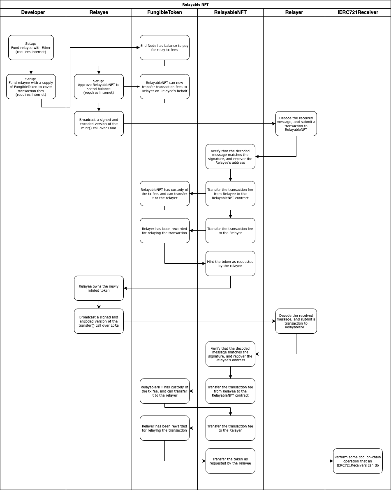
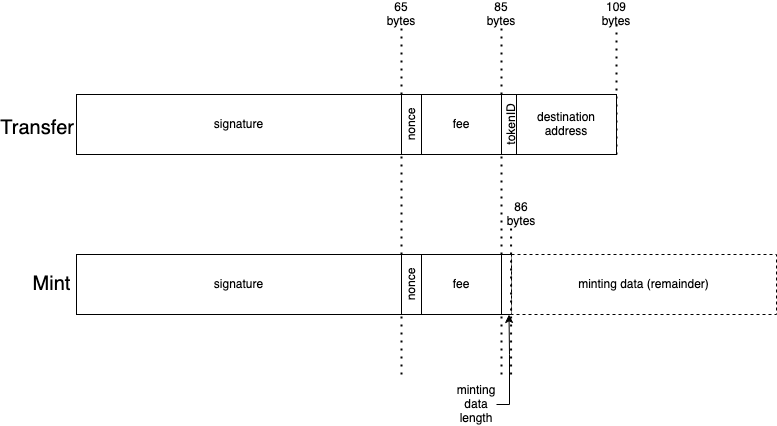

# A Real World Example

We’ve talked a lot about the challenges of designing a system which enables an LPWAN device to interact with the blockchain, but there’s no better way to see it all come together than with an example. Let’s see what it would take to have an LoRa device mint and transfer an ERC721 NFT without ever talking to Ethereum directly. This was chosen as an example of how very complex on-chain behaviors can be triggered with an otherwise rather simple mechanism. Namely, the ERC721 specification allows for smart contracts that are aware of NFTs to perform complex operations upon receiving them, meaning that any contracts downstream of the relaying operation need not necessarily be aware of the fact that their transaction was even done by means of relay.

This example can be found in the [FOAM Lite Repository](https://github.com/f-o-a-m/foam.lite). Particular attention should be paid to [RelayableNFT.sol](https://github.com/f-o-a-m/foam.lite/blob/main/contracts/RelayableNFT.sol) and [RelayingUtils.sol](https://github.com/f-o-a-m/foam.lite/blob/main/contracts/RelayingUtils.sol). The actual functions are thoroughly documented in the code, and this page serves to provide a higher-level overview of what’s actually happening and the motivations for the design decisions.

## The Basics

We will use an ERC20 token to cover transaction fees, unoriginally named `FungibleToken`. Our relay-aware NFT is equally unimaginatively named `RelayableNFT`. `RelayableNFT` has two special functions, `mintRelayed` and `transferRelayed`. Our Relayer is constantly listening for messages over LoRa. If it sees a message that looks like it might be a compact encoding of a mint or transfer transaction, it’ll try decoding it into a `mintRelayed` or `transferRelayed` call against the `RelayableNFT` contract. If this runs successfully, and the transaction fee is deemed lucrative enough, then the Relayer will submit the respective call to the blockchain.

Relayable NFT swimlane

We will choose to simply specify the transaction fee as part of our FOAM Lite message, and assume that it will come out of the Relayee’s own balance of the token. So, we require some one-time interaction with the blockchain to fund our end node with a balance of the token, and have the end node directly submit a transaction to the blockchain to approve the RelayableNFT contract to spend FungibleToken on its behalf to cover relayer fees. As previously discussed, this solution is far from optimal, but suitable for the purposes of illustration.

## The Details

While the mechanics of ERC20 approvals and transfers and ERC721 minting and transfers are well described in other literature by now, we have yet to describe what data is sent over LoRa and how it ties into the `mintRelayed` and `transferRelayed`. As we’ve previously identified, our over-the-air message needs to contain the following data:

1. A signature to authenticate the sender and contents of the message
2. A nonce to prevent replay attacks
3. A transaction fee to incentivize the relayer to actually relay the transaction to the blockchain
4. The actual intended action of the transaction
    1. In the case of a transfer, we need to supply the token ID to be transferred and a destination address
    2. In the case of a mint, we simply need to supply the token data of the token we are minting

We will choose use a regular `secp256k1` signature, as it is easy to recover the address of the sender from the signature assuming the data is valid, and the EVM has native functionality to do so anyway.

We will use a `uint32` nonce, because it’s only four bytes long and 2.147B possible values ought to be enough for anyone.

For the sake of compactness, we will use a `uint128` for our transaction fee amount. This may seem strange at first — after all, we’re using an ERC20 token which can operate on amounts storable within a `uint256`! Well, when minting NFTs, we want to maximize the available payload to store token data, and for our application, we’ve determined that the additional 16 bytes of token data is a worthwhile tradeoff. Really, we could’ve probably shrank that down even further, but for illustrative purposes we’ve chosen to stick with `uint128`.

When minting over relay, we can immediately see the need for a more compact encoding scheme. Typically, an Ethereum ABI encoded string or byte array takes up at least 64 bytes! A `uint256` to store the offset at which the string starts, and another one to store the length. Considering our LoRa packet can never be more than 255 bytes, it would be ludicrous to waste 1/4 of that on an offset that’s redundant, as we can just immediately start the string after our signature, nonce, and fee. And using anything more than a `uint8` for the string length would be equally insane, as that already encompasses more than can ever be fit in the payload. So, we would prefer to encode our strings as a `uint8` followed by the actual string contents, which spares us 63 bytes of payload. Not bad!

Finally, when transferring this NFT over relay, we’ve chosen to use a `uint32` as the NFT `tokenID`. Again, this may seem strange, considering that your typical ERC721 contract handles `tokenIDs` of `uint256`, but we are optimizing for payload size here. With LoRa, certain radio settings allow for greater range at the cost of payload size, and by fitting our total payload to under 115 bytes we can leverage those settings to achieve greater range.

Sketching out the layout of our payloads, the size advantage we achieve over conventional ABI encoding over the air become readily apparent.

OTA Payloads

## Signature Process

We’ve decided that our over-the-air packet will use different sizes integers for its parameters than an ERC721 token contract typically expects. This now raises the question — how do we actually authenticate the message? What should go into the digest that will get signed by our private key? How will the relayer pass this information to the smart contract?

So long as the smart contract is able to reconstruct the original “full” intended message from the compacted form, the answer is technically “whatever you want”. However, when you are considering supporting different kinds of messages, you will need to consider the possibility of the same encoding having multiple meanings. In our example, a 23-byte mint would have the same length as a transfer, and because we don’t have any marker to distinguish the two types of payloads, there’s no immediately obvious way to decide how to interpret a 109-byte payload.

We’ve chosen to use the `personal_sign` hash of the `abi.encodePacked()` representation of the full contract parameters as the signing digest when calculating signatures. The packed ABI encoding of the `bytes` for the token data would ensure that the representation used to calculate the signing hash would not collide with that of the token ID and destination address for the transfer. This makes the odds of a hash collision between the two possible message types that could still ecrecover to a valid relayable transaction astronomically low. We opted to use a `personal_sign`-style hash mostly out of custom, since we’re technically signing arbitrary data with our key rather than a “real” transaction. The result of this is that even if you were able to technically parse a legitimate message as both a mint and a transfer, only of the two interpretations would have a valid signature for its contents.