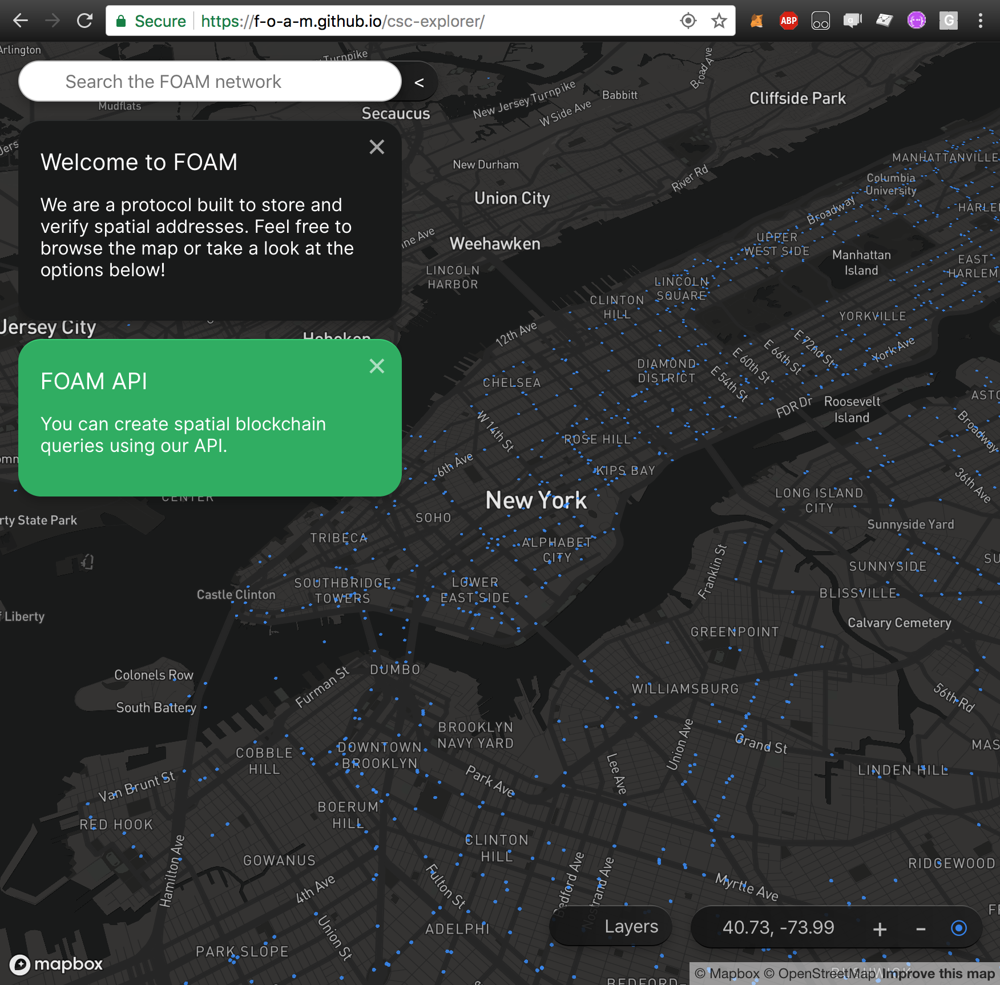

title: CSC-Explorer
---

# Introduction

This article outlines a sample `react` application that uses the FOAM API.
+ The source of the application can be found on [github](https://github.com/f-o-a-m/csc-explorer).
+ You can see a hosted version [here](https://f-o-a-m.github.io/csc-explorer/)

