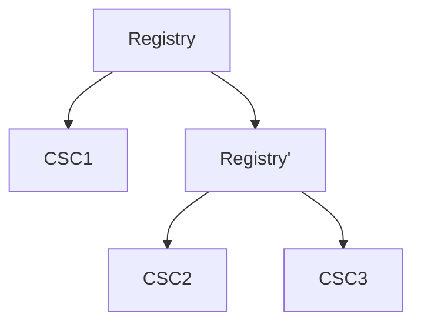
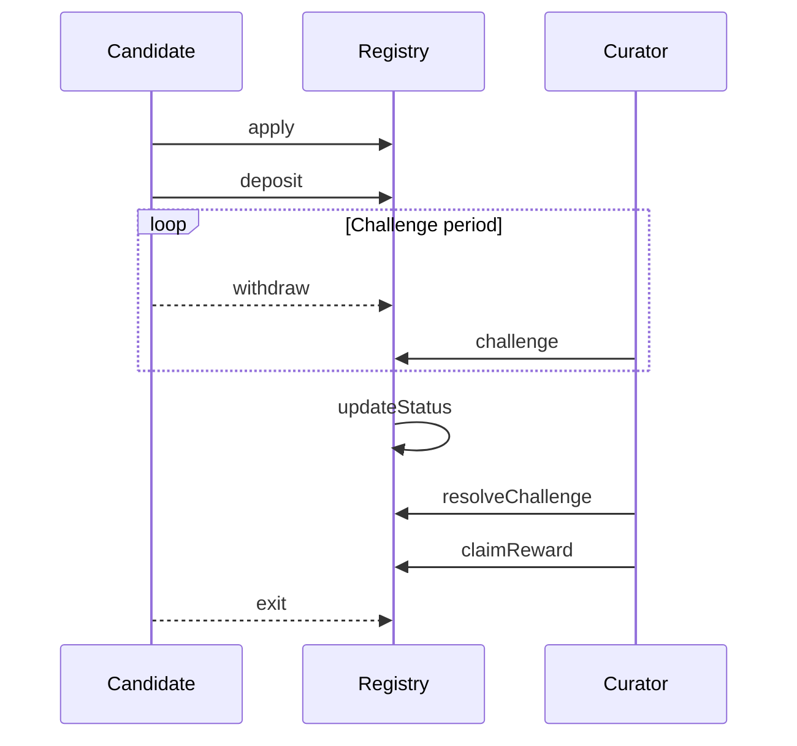
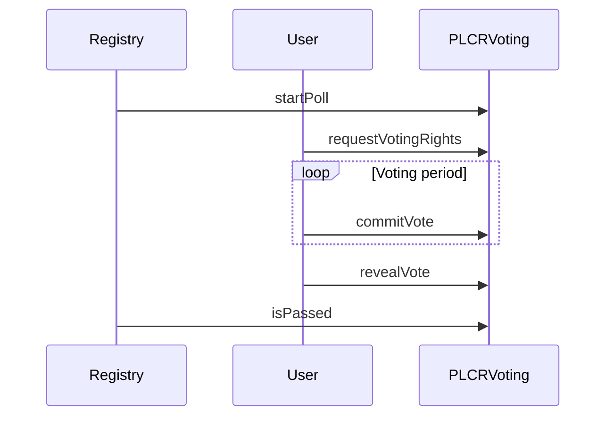
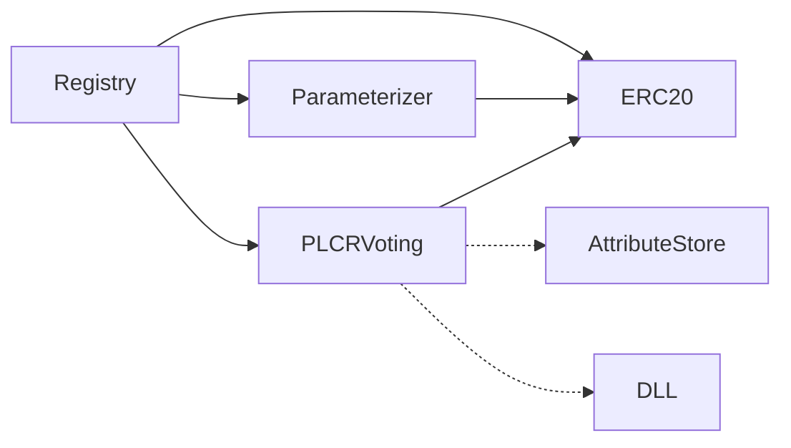

# User flows

## Example FoamTCR



## Simple proposal overview





# Contracts


## Contract hierarchy



## `Registry`

The purpose of this contract is to maintain a map `listings`.

- consumers view `listings`
- candidates wants to be included in `listings`
- curators vote on whether candidates are to be included or not

### State

Has

```haskell
listings :: Map (BytesN 32) Listing
```

where

```haskell
data Listing =
  { applicationExpiry :: UINT
  , whitelisted       :: Boolean
  , owner             :: Address
  , unstakedDeposit   :: UINT
  , challengedID      :: UINT
}
```


and

```haskell
challenges :: Map UINT Challenge -- maintained for
                                 -- prospective listings
````

where

```haskell
data Challenge =
  { rewardPool          :: UINT
  , challenger          :: Address
  , resolved            :: Bool
  , stake               :: UINT
  , totalTokens         :: UINT
  , voterCanClaimReward :: Map Address Boolean
  }
```

```haskell
listingHash
  :: Geohash
  -> Address
  -> BytesN 32
```

### Events

```haskell
_Application
  :: BytesN 32 -- listingHash
  -> UINT      -- deposit
  -> String    -- data

_Challenge
  :: BytesN 32 -- listingHash
  -> UINT      -- deposit
  -> UINT      -- pollID
  -> String    -- data

_Deposit
  :: BytesN 32 -- listingHash
  -> UINT      -- added
  -> UINT      -- newTotal

_Withdrawal
  :: BytesN 32 -- listingHash
  -> UINT      -- withdrew
  -> UINT      -- newTotal

_NewListingWhitelisted
  :: BytesN 32 -- listingHash

_ApplicationRemoved
  :: BytesN 32 -- listingHash

_ListingRemoved
  :: BytesN 32 -- listingHash

_ChallengeFailed
  :: UINT      -- challengeID

_ChallengeSucceeded
  :: UINT      -- challengeID

_RewardClaimed
  :: Address   -- voter
  -> UINT      -- challengeID
  -> UINT      -- reward
```

## `PLCRVoting`

Partial-Lock-Commit-Reveal Voting scheme

### Events

```haskell
VoteCommitted
  :: Address -- voter
  -> UINT    -- pollID
  -> UINT    -- numTokens

VoteRevealed
  :: Address -- voter
  -> UINT    -- pollID
  -> UINT    -- numTokens
  -> UINT    -- choice

PollCreated
  :: UINT    -- voteQuorum
  -> UINT    -- commitDuration
  -> UINT    -- revealDuration
  -> UINT    -- pollID

VotingRightsGranted
  :: Address -- voter
  -> UINT    -- numTokens

VotingRightsWithdrawn
  :: Address -- voter
  -> UINT    -- numTokens
```

## `Parameterizer`

Think of this as a parameter store, keys are hashed with `keccak`. However, it also has a voting functionality for reparameterizing. **We won't use the voting for now**.

### State

Has

```haskell
params :: Map (BytesN 32) UINT
```

**It also has, but we won't use:**

```haskell
challenges :: Map UINT Challenge
```

and

```haskell
proposals :: Map (BytesN 32) Proposal
```

### Events

**We will not use these for now**

```haskell
_ReparameterizationProposal
  :: Address   -- proposer
  -> String    -- name
  -> UINT      -- value
  -> BytesN 32 -- propID

_NewChallenge
  :: Address   -- challenger
  -> BytesN 32 -- propID
  -> UINT      -- pollID
```