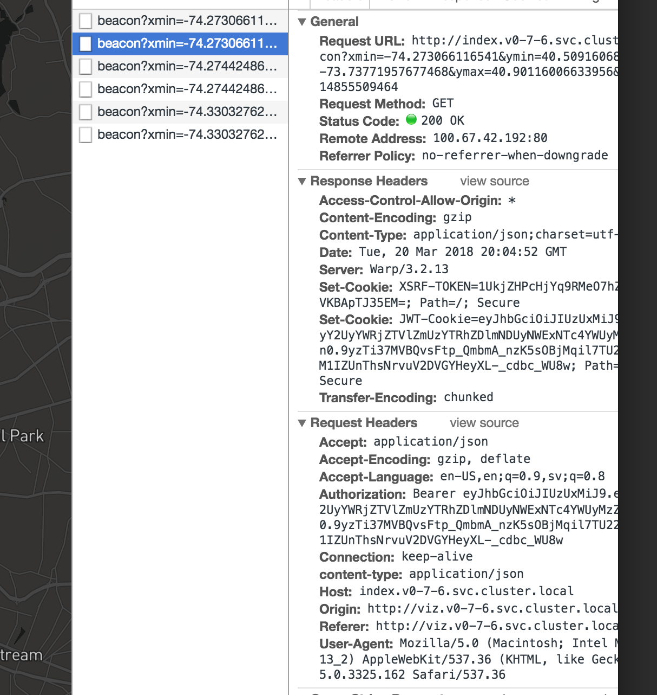

title: Intro to the FOAM API
---

# Authorization

The steps for authorization to the API are as follows. When you go to the [SpatialIndex beta](https://beta.foam.space), it instructs you how to login using Metamask (uPort support is under-way):

You will be asked to sign a message. The message looks garbled but that [issue](https://github.com/ethereum/EIPs/pull/712) is currently out of our control:

Once signed, your browser will have a Bearer token in all of the subsequent requests to the API. By going to the developer console of your browser and inspecting the network requests, you should be able to see it as described below:

